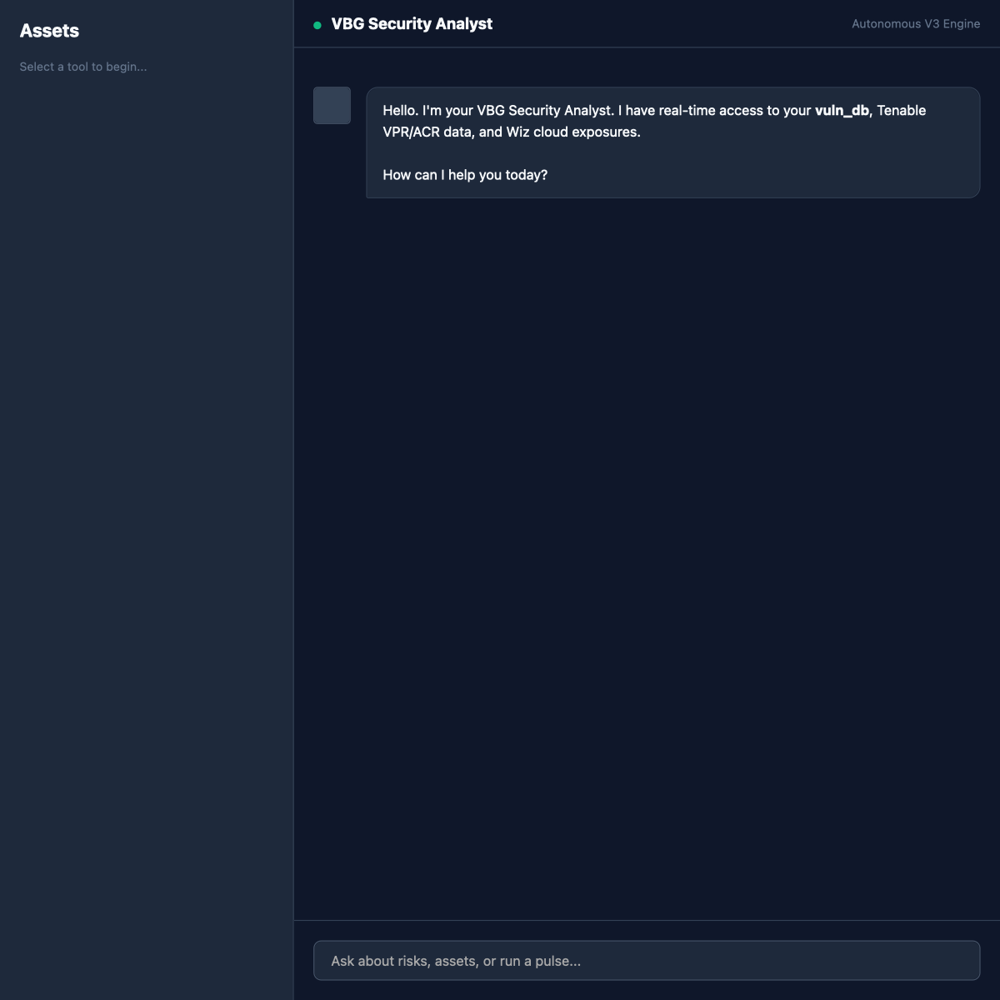

# 🤖 Security Prioritizer & TI Skills Workspace

> Built with VBG CLI

This project is a centralized repository for specialized security operations skills focused on threat intelligence and vulnerability prioritization. These skills empower **VBG CLI** to act as a security analyst by correlating data across multiple platforms and providing actionable insights directly in the terminal.

## 🚀 Quick Start (First Steps)

If you have just downloaded or cloned this repository, follow these steps to get started:

### 1. Install Dependencies
Ensure you have **Node.js (v18+)** and **Python (3.9+)** installed, then run:

**Node.js Modules:**
```bash
npm install
```

**Python Modules:**
*Note: If you are using Python-based MCP servers or scripts:*
```bash
# Create a virtual environment (recommended)
python3 -m venv venv
source venv/bin/activate

# Install requirements (if provided)
pip install -r requirements.txt
```

### 2. Configure Your Environment
Create a `.env` file from the provided example and add your API keys (Wiz, Tenable, VirusTotal, etc.):
```bash
cp .env.example .env
# Edit .env with your credentials
```

### 3. Install VBG CLI Skills
Install the specialized security skills into your VBG CLI environment:
```bash
# Example: Install the prioritizer and TI enricher
gemini skills install ./security-prioritizer.skill --scope user
gemini skills install ./ti-master-enricher.skill --scope user
```
*Note: You can install any of the `.skill` files found in the root directory.*

### 4. Initialize the Engine
Reload the VBG CLI to activate the newly installed skills:
```bash
/skills reload
```

### 5. Start the Security Dashboard
Launch the interactive web-based chat interface:
```bash
npm start
```
*Access the UI at: **http://localhost:3001***

## 🖥️ Interface Preview

The **VBG Security Chat UI** provides a modern, conversational command center for your SOC operations.



### Features:
*   **Real-time Analysis**: "What are my top 10 risks?"
*   **Instant Enrichment**: "Enrich IP 20.13.168.53"
*   **Rich Data**: Formatted tables, risk-coded badges, and markdown support.
*   **Integrated Reports**: One-click access to deep-dive HTML reports.

---

## 🛠️ Featured Skills & Tools

| Component | Purpose | Key Data Sources |
| :--- | :--- | :--- |
| **`Security Chat UI`** | Interactive web dashboard for SOC analysts. | React / Node.js API |
| **`security-prioritizer`** | Correlates & ranks vulnerabilities based on risk. | Tenable, Wiz, CISA KEV |
| **`auto-analyst`** | Fully autonomous daily risk analysis & alerting. | GitHub Actions / Cron |
| **`vulnerability-validator`** | Validates vulnerabilities via active scans. | Nuclei, Nmap |
| **`ti-master-enricher`** | Orchestrates multi-source TI lookups (Consensus). | GreyNoise, OTX, VirusTotal |
| **`asset-email-reporter`** | Sends automated remediation alerts via SMTP. | Node.js / Nodemailer |

## 📖 Documentation

- **[ONBOARDING.md](ONBOARDING.md)**: New user "Quick Start" and common troubleshooting.
- **[GEMINI.md](GEMINI.md)**: Detailed architecture, scoring models, and development workflows.
- **`workflows/`**: Step-by-step playbooks for specific security tasks.

---

🤖 Generated with VBG CLI
